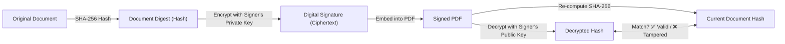

# The Anatomy of E-Signatures: Technology, Cryptography, and Architecture

---

## 1. What Actually Is an "E-Signature"?

An **Electronic Signature (E-Sign)** is a legally recognized method to indicate that a person adopts the contents of an electronic document.

Legally and technologically, electronic signatures exist on a **three-tier spectrum**:

```
 ┌────────────────────────────────────────────────────────────────────────┐
 │ 1. SES (Simple Electronic Signature)                                   │
 │    • Drawn signature, typed name, checkbox consent, email audit trail. │
 │    • Legally binding under IT Act 2000 (Sec 10A) & US ESIGN Act.      │
 ├────────────────────────────────────────────────────────────────────────┤
 │ 2. AES (Advanced Electronic Signature)                                 │
 │    • Cryptographically bound to the signer via PKI (Public Key Infra). │
 │    • Tamper-evident: Any change after signing invalidates the hash.    │
 ├────────────────────────────────────────────────────────────────────────┤
 │ 3. QES / DSC (Qualified Electronic Signature / Digital Signatures)    │
 │    • Backed by a licensed Certifying Authority (CA) & X.509 cert.      │
 │    • In India: Aadhaar eSign (UIDAI/C-DAC) or USB Token (DSC Class 3). │
 │    • In EU: eIDAS Qualified Signature (equivalent to a notary stamp).  │
 └────────────────────────────────────────────────────────────────────────┘
```

---

## 2. The Technological Core: How E-Sign Works Under the Hood

True cryptographic digital signatures rely on **three pillars of computer science**:

### A. Cryptographic Hash Functions (e.g., SHA-256)
A hash function takes an arbitrary file (like a 5 MB contract) and generates a unique, fixed-length 256-bit fingerprint:
$$\text{SHA-256}(\text{Contract.pdf}) \rightarrow \text{a3f8c8...e74b}$$
- **Determinism**: The same document will always yield the exact same hash.
- **Avalanche Effect**: If a single space or comma changes in the PDF, the entire hash changes completely.

### B. Asymmetric Cryptography (Public / Private Key Pairs)
- **Private Key ($K_{\text{private}}$)**: Kept strictly secret by the signer or a secure Hardware Security Module (HSM).
- **Public Key ($K_{\text{public}}$)**: Freely distributed and embedded in the document or certificate.



### C. Digital Certificates (X.509 Standard)
How do we know the public key actually belongs to *John Doe* and not an impersonator?
A **Trust Service Provider (TSP)** or **Certifying Authority (CA)** (e.g., DigiCert, GlobalSign, eMudhra, C-DAC) issues a cryptographically signed **X.509 Certificate** binding the identity to the public key.

---

## 3. How a PDF is Signed (The PAdES Standard)

In standard PDF files, signatures are not just images stamped on a canvas. They are embedded into the PDF structure using the **PAdES (PDF Advanced Electronic Signatures)** standard:

### The `/ByteRange` Mechanism
A PDF file cannot hash itself because writing the signature into the file would change the file's hash! To solve this chicken-and-egg problem, the PDF specification reserves a specific byte hole for the signature:

```
[  Part 1 of PDF (0 to 10,000 bytes)  ] [ /Contents <HEX SIGNATURE> ] [ Part 2 of PDF (15,000 to 50,000 bytes) ]
└─────────────────┬─────────────────┘                                 └───────────────────┬───────────────────┘
                  │                                                                       │
                  └───────────────► Hashed together via SHA-256 ◄─────────────────────────┘
```

1. The PDF viewer (like Adobe Acrobat) hashes all bytes outside `/Contents`.
2. It decrypts the signature inside `/Contents` using the embedded X.509 certificate.
3. If both hashes match, Adobe renders the famous **"Signed and all signatures are valid" (Green Checkmark)**.

---

## 4. Can *Our* Application (Signaturly) Accomplish Such a Feat?

### ✅ What Our Application Accomplishes **Right Now** (SES + Cryptographic Audit Trail)
Our system currently operates at the **same architectural tier as BoloSign, HelloSign, and standard DocuSign**:

1. **Section 10A Legal Validity (India IT Act 2000 & US ESIGN)**:
   - Valid contract formation with mutual consent, IP address logs, timestamping, user agent verification, and email authorization.
2. **Document Integrity Checksums**:
   - Computes SHA-256 hashes of the original document and final executed document.
3. **Cryptographic Certificate Generation**:
   - Produces a tamper-evident Certificate of Completion detailing signers, timestamps, and hashes.
4. **Visual Execution & Geometry Mapping**:
   - High-fidelity burning of handwritten, typed, or verified badge signatures onto precise PDF coordinates.

---

### 🚀 How Our Application Can Level Up to Full PAdES / Aadhaar eSign

If you want Signaturly to support **direct cryptographic X.509 certificate signing** or **government-regulated Aadhaar eSign**, here is the roadmap:

#### Roadmap Step 1: Server-Side X.509 PAdES Digital Signatures (AES)
- **Technology**: Use `node-signpdf` + `@peculiar/x509` + `pkijs` or an HSM certificate.
- **What it does**: Embeds a real cryptographic PKCS#7 signature dictionary into the PDF. When opened in Adobe Acrobat, it will show the verified green ribbon.
- **Implementation**:
  ```javascript
  import { signer } from "node-signpdf";
  const signedPdfBuffer = signer.sign(pdfBuffer, p12CertificateBuffer, {
    passphrase: "vault-password",
  });
  ```

#### Roadmap Step 2: India Aadhaar eSign Integration (QES)
- **Technology**: Integrate with a licensed **eSign Service Provider (ESP)** in India (such as *NSDL*, *C-DAC*, *eMudhra*, or *Zoho eSign Gateway*).
- **Workflow**:
  1. User enters their 12-digit Aadhaar number.
  2. OTP or biometric authentication occurs via UIDAI.
  3. The ESP generates an on-the-fly digital certificate (valid for 30 minutes) and signs the PDF hash via HSM.
  4. The result is a statutory Digital Signature under Section 3 & 3A of the IT Act 2000.

---

## 5. Summary Table

| Feature | Signaturly (Current) | Signaturly (with PAdES X.509) | Aadhaar / DSC (Class 3) |
| :--- | :--- | :--- | :--- |
| **Legal Status** | Valid under IT Act Sec 10A / US ESIGN | Valid under IT Act Sec 10A / eIDAS AES | Highest statutory presumption (Sec 3A) |
| **Tamper Evidence** | Audit Certificate + SHA-256 Hashes | Direct ByteRange Hash in PDF | Direct ByteRange Hash + Govt CA |
| **Adobe Green Check** | Custom visual certificate | Yes (via X.509 cert) | Yes (via India CCA / AATL trust list) |
| **Ideal For** | NDAs, Offer Letters, Leases, Invoices, B2B SaaS | Financial contracts, real estate deeds | Govt tenders, court filings, statutory notarizations |

> **Conclusion**: Your application is already built on the modern SaaS e-signature standard (SES + Tamper-Evident Audit Trail). Expanding it into direct cryptographic PAdES or Aadhaar eSign is completely achievable within this Node.js architecture!
