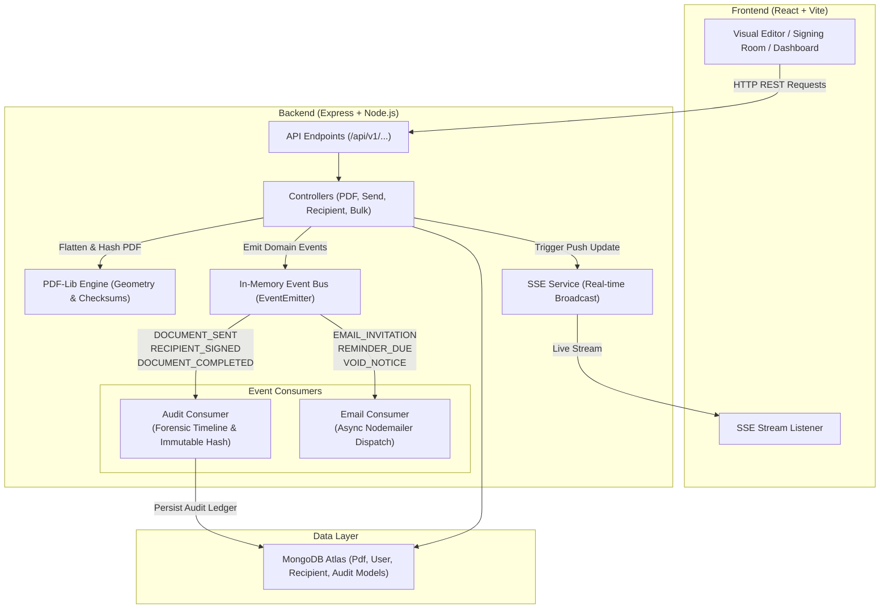

# ⚡ Signaturly Pro — Enterprise Electronic Signature & Contract Lifecycle Platform

<p align="center">
  
  
  
  
  
  
  
</p>

---

## 📑 Table of Contents
1. [Overview](#-overview)
2. [Key Capabilities & Features](#-key-capabilities--features)
3. [Architecture & Event-Driven Engine](#-architecture--event-driven-engine)
4. [Statutory Compliance & Cryptography](#-statutory-compliance--cryptography)
5. [Complete System Walkthrough & Pages](#-complete-system-walkthrough--pages)
6. [API Reference & Endpoints](#-api-reference--endpoints)
7. [Installation & Local Quickstart](#-installation--local-quickstart)
8. [Docker & Cloud Run Deployment](#-docker--cloud-run-deployment)
9. [Documentation Suite](#-documentation-suite)
10. [License & Credits](#-license--credits)

---

## 🌟 Overview

**Signaturly Pro** is a modern, enterprise-grade digital signature and document lifecycle management platform. Built from the ground up for high reliability, statutory audit integrity, and an intuitive user experience, Signaturly enables businesses and individuals to execute legally binding contracts with cryptographic certainty.

### Why Signaturly Pro?
- 🔒 **Legally Enforceable**: Adheres to US ESIGN Act (15 U.S.C. § 7001), Indian IT Act 2000 (Section 10A), and EU eIDAS (No 910/2014).
- 🛡️ **Tamper-Evident SHA-256 Hashing**: Baseline and final document digests recorded immutably.
- ⚡ **Event-Driven Architecture**: Decoupled in-memory Event Bus powering background audit logging and asynchronous email dispatch.
- 🔄 **Real-Time Live Updates**: Server-Sent Events (SSE) provide instant status synchronization across signing rooms and dashboards.
- 🎨 **Rich Signature Studio**: Draw, Type (with calligraphic fonts), Upload, AI Transparent Background Eraser, and Initials Studio.
- 📊 **CSV Bulk Mail Merge**: Dispatch personalized contract templates to hundreds of signers simultaneously with custom merge tags.
- 📜 **Cryptographic Audit Certificates**: Auto-appended completion certificates with QR verification codes and UTC timestamps.

---

## 🚀 Key Capabilities & Features

### 1. Document Ingestion & Inner PDF Visual Editor
- **72 DPI Coordinate Mapper**: Converts browser canvas coordinates to precise PDF point geometry.
- **Drag-and-Drop Fields**: Signature, Initials, Date Signed, Text Input, and Checkbox.
- **Multi-Party Color Coding**: Distinct visual palettes per recipient for clear assignment.

### 2. Multi-Mode Signature Studio & Initials
- **Draw**: High-precision vector canvas with bezier smoothing.
- **Type**: 4 curated cursive fonts (*Dancing Script, Great Vibes, Pacifico, Alex Brush*).
- **Upload**: Scanned physical signature image ingestion.
- **AI Background Eraser**: Threshold-based transparency removal for clean signature seals.
- **Initials Studio**: Quick multi-page initials stamping.
- **Signature Vault**: Save, manage, and toggle default signatures across devices.

### 3. Multi-Recipient Workflow Engine
- **Sequential & Parallel Routing**: Set strict signing orders (Signer 1 ➔ Signer 2) or simultaneous execution.
- **Email OTP Passcode Gate**: Optional 6-digit one-time passcode verification before viewing contracts.
- **Automated Expiration & Reminders**: Configurable document expiration deadlines and automated reminder crons.
- **Document Voiding Flow**: Cancel in-flight envelopes with custom reason recording and immutable void certificates.

### 4. Reusable Templates & Bulk Mail Merge
- **14 Prebuilt Statutory Templates**: NDAs, Employment Offers, MSAs, Leases, SOWs, IP Assignments, and more.
- **Dynamic Tag Interpolation**: Replaces `{{name}}`, `{{company}}`, `{{date}}`, etc., on the fly.
- **CSV Bulk Dispatch**: Mass token generation, header mapping, and asynchronous progress tracking.

### 5. Audit Trail & Public Verification Portal
- **Tamper-Evident Audit Certificate**: Generated upon completion with full forensic metadata (IP, User Agent, Timestamps, SHA-256).
- **Public Verification**: `/verify` endpoint allows anyone to drag & drop a signed PDF or scan the certificate QR code to verify integrity against the database ledger.

---

## 🏗️ Architecture & Event-Driven Engine

Signaturly Pro utilizes an asynchronous, decoupled event-driven architecture to guarantee high throughput and resilience:



### Supported Event Bus Types
| Event Type | Trigger | Actions Executed |
| :--- | :--- | :--- |
| `DOCUMENT_SENT` | Sender dispatches envelope | Emits audit log entry; sends email invitations to first active signers. |
| `RECIPIENT_SIGNED` | Recipient completes fields | Records signature biometric hash; advances sequential workflow; notifies sender via SSE. |
| `DOCUMENT_COMPLETED` | All recipients have executed | Flattens final PDF; generates SHA-256 certificate; emails final executed PDF to all parties. |
| `DOCUMENT_VOIDED` | Sender cancels contract | Updates status; logs void reason; sends void notification emails; invalidates signing links. |
| `DOCUMENT_EXPIRED` | Deadline cron trigger | Updates status to expired; dispatches cancellation alerts. |
| `REMINDER_DUE` | Reminder cron trigger | Sends email reminders to pending signers with active signing links. |
| `BULK_SEND_BATCH_PROCESSED` | CSV batch completed | Logs bulk batch status; updates campaign metrics. |

---

## 📜 Statutory Compliance & Cryptography

```
+────────────────────────────────────────────────────────────────────────────────────────+
|                               LEGAL COMPLIANCE MATRIX                                 |
+──────────────────────────+────────────────────────────+───────────────────────────────+
| Statutory Regulation     | Legal Jurisdiction         | Signaturly Verification Proof |
+──────────────────────────+────────────────────────────+───────────────────────────────+
| US ESIGN Act (15 U.S.C.) | United States (Federal)    | E-Consent Gate, Audit Trail,  |
|                          |                            | SHA-256 Tamper-Proof Digest   |
| Section 10A IT Act 2000  | India (National)           | Email OTP Authentication,     |
|                          |                            | UTC Timestamp & IP Address    |
| EU eIDAS (No 910/2014)   | European Union             | AES Checksums, Biometric Form |
|                          |                            | Flattening & Certificate Seal |
+──────────────────────────+────────────────────────────+───────────────────────────────+
```

---

## 🗺️ Complete System Walkthrough & Pages

| Route | Page Name | Primary Capability |
| :--- | :--- | :--- |
| `/` & `/landing` | **Marketing Hub** | Platform overview, compliance badges, instant registration gate. |
| `/login` & `/register` | **Authentication Vault** | JWT authentication, statutory terms & conditions consent gate. |
| `/dashboard` | **Workspace Dashboard** | Metrics overview, live contract filter tabs, search, quick actions. |
| `/upload` | **Document Dropzone** | Ingestion pipeline with automatic page extraction and SHA-256 hashing. |
| `/assign/:pdfId` | **Canvas Field Studio** | 72 DPI drag-and-drop field assignment with color-coded signers. |
| `/send/:pdfId` | **Routing & Security** | Sequential/parallel signers, Email OTP passcode, reminders & expiration. |
| `/sign/:token` | **Recipient Signing Room** | OTP verification, Draw/Type/Upload/AI signature studio, progress bar. |
| `/editor/:pdfId` | **Audit Inspector** | Multi-page PDF viewer, real-time audit log timeline, voiding actions. |
| `/templates` | **Template Library** | 14 prebuilt legal contracts with category filtering and instant clone. |
| `/templates/bulk` | **CSV Bulk Mail Merge** | Header-to-tag mapping, mass generation, and batch send progress. |
| `/signature-remover` | **AI Background Eraser** | Image thresholding for signature transparency and contrast tuning. |
| `/settings` | **Profile & Preferences** | User profile, password management, and terms acceptance audit badge. |
| `/verify` | **Public Verification** | Drag & drop PDF hash verifier and QR certificate validator. |
| `/admin/*` | **Superadmin Portal** | System analytics, user moderation, storage quotas, and security audit. |

---

## 🔌 API Reference & Endpoints

### Authentication (`/api/v1/auth`)
- `POST /register`: Create new user account with legal consent timestamp.
- `POST /login`: Authenticate and issue JWT access token.
- `POST /forgot-password` & `POST /reset-password`: Account recovery workflow.
- `GET /me`: Fetch authenticated user profile and terms metadata.

### PDF & Document Lifecycle (`/api/v1/pdf`)
- `POST /upload`: Upload PDF file (multipart/form-data).
- `GET /list`: Retrieve user's document vault with status filters.
- `GET /:id`: Fetch document metadata, pages, and placed fields.
- `POST /save-fields/:id`: Persist assigned field coordinates and signer mappings.
- `POST /void/:id`: Void an active document with reason.
- `GET /download/:id`: Download executed PDF.
- `GET /certificate/:id`: Download cryptographic Audit Certificate.

### Dispatch & Routing (`/api/v1/send`)
- `POST /:pdfId`: Dispatch document to recipients with routing rules and OTP configuration.
- `POST /bulk-send`: Execute CSV bulk mail merge with template tag replacement.
- `POST /remind/:pdfId`: Trigger manual on-demand reminder email.

### Recipient Signing (`/api/v1/recipient`)
- `GET /access/:token`: Verify recipient token and retrieve document signing session.
- `POST /verify-otp/:token`: Verify 6-digit email OTP for passcode-protected envelopes.
- `POST /sign/:token`: Submit signature fields, flatten PDF, and execute contract.

### Public Verification & Real-Time Stream
- `POST /api/v1/verify`: Verify uploaded PDF SHA-256 hash against ledger.
- `GET /api/v1/sse/stream`: Real-time Server-Sent Events stream for live document status updates.

---

## 💻 Installation & Local Quickstart

### Prerequisites
- **Node.js**: v18.0.0 or higher
- **npm**: v9.0.0 or higher
- **MongoDB**: Local instance or MongoDB Atlas URI

### 1. Clone Repository
```bash
git clone https://github.com/sulaimankhan8/Signaturly.git
cd Signaturly
```

### 2. Environment Configuration
Create `.env` inside `server/`:
```env
PORT=5000
NODE_ENV=development
MONGO_URI=mongodb://localhost:27017/signaturly
JWT_SECRET=your_super_secret_jwt_key_here
CLIENT_URL=http://localhost:5173

# SMTP Configuration (for invitation emails & OTPs)
EMAIL_SERVICE=gmail
EMAIL_USER=your_email@gmail.com
EMAIL_PASS=your_app_password
EMAIL_FROM=Signaturly Pro <no-reply@signaturly.com>

# Superadmin Configuration
ADMIN_SECRET_KEY=super_admin_vault_key_2026
```

### 3. Install Dependencies
```bash
# Root and Client dependencies
npm install

# Server dependencies
cd server && npm install && cd ..
```

### 4. Run Development Servers
```bash
# Start backend server (port 5000) and frontend client (port 5173)
npm run dev
```

---

## 🐳 Docker & Cloud Run Deployment

### Local Docker Compose
```bash
docker-compose up --build -d
```

### Google Cloud Run Deployment
Signaturly Pro is fully optimized for continuous deployment to Google Cloud Run using **Workload Identity Federation (WIF)** for keyless, secure CI/CD via GitHub Actions.

See the complete guide in [docs/DEPLOYMENT_GUIDE.md](file:///c:/Users/Sulaiman/Desktop/Signaturly/docs/DEPLOYMENT_GUIDE.md).

---

## 📚 Documentation Suite

- 📖 **User Guide & Page Manual**: [docs/USER_GUIDE_MANUAL.md](file:///c:/Users/Sulaiman/Desktop/Signaturly/docs/USER_GUIDE_MANUAL.md)
- 🗺️ **Complete User Flows Manual**: [docs/USER_FLOWS_MANUAL.md](file:///c:/Users/Sulaiman/Desktop/Signaturly/docs/USER_FLOWS_MANUAL.md)
- ⚖️ **E-Signature Legal & Cryptographic Guide**: [E_SIGNATURE_GUIDE.md](file:///c:/Users/Sulaiman/Desktop/Signaturly/E_SIGNATURE_GUIDE.md)
- ☁️ **Cloud Deployment Masterclass**: [docs/DEPLOYMENT_GUIDE.md](file:///c:/Users/Sulaiman/Desktop/Signaturly/docs/DEPLOYMENT_GUIDE.md)
- 📋 **Implementation & Architecture Plan**: [IMPLEMENTATION_PLAN.md](file:///c:/Users/Sulaiman/Desktop/Signaturly/IMPLEMENTATION_PLAN.md)

---

## 📄 License & Credits
Distributed under the MIT License. Built with ❤️ for secure, legally binding electronic signatures.
