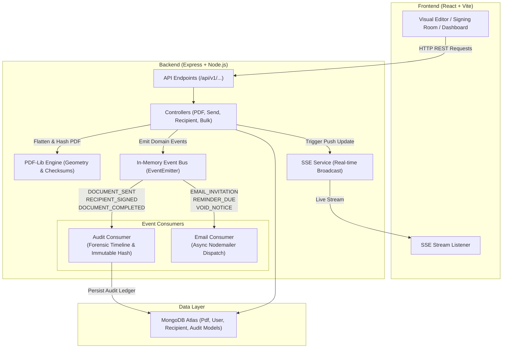

# 📖 Signaturly Pro — Complete User Guide & Technical Manual

---

## 📌 1. Executive Summary & Legal Compliance Framework

**Signaturly Pro** is an enterprise-grade electronic signature and document lifecycle management platform built for legal enforceability, statutory audit integrity, and frictionless contract execution.

### Global Legal Compliance Standards
- **US ESIGN Act (15 U.S.C. § 7001)**: Mandatory electronic record disclosure, explicit intent capture, SHA-256 tamper-evident checksums, and immutable audit certificate generation.
- **Section 10A Indian IT Act 2000**: Statutory validity of electronic contracts, multi-factor recipient verification (Email OTP), and timestamped IP logging.
- **EU eIDAS Regulation (No 910/2014)**: Advanced Electronic Signature (AES) standards, cryptographic checksums, and biometric signature canvas logging.

```
+────────────────────────────────────────────────────────────────────────────────────────+
|                             LEGAL & STATUTORY COMPLIANCE                              |
+──────────────────────────+────────────────────────────+───────────────────────────────+
| Statutory Regulation     | Legal Jurisdiction         | Signaturly Verification Proof |
+──────────────────────────+────────────────────────────+───────────────────────────────+
| US ESIGN Act (15 U.S.C.) | United States (Federal)    | E-Consent Gate, Audit Trail,  |
|                          |                            | SHA-256 Tamper-Proof Digest   |
| Section 10A IT Act 2000  | India (National)           | Email OTP Authentication,     |
|                          |                            | UTC Timestamp & IP Address    |
| EU eIDAS (No 910/2014)   | European Union             | AES Checksums, Biometric Form |
|                          |                            | Flattening & Certificate Seal |
+──────────────────────────+────────────────────────────+───────────────────────────────+
```

---

## 🏗️ 2. Core Platform Architecture & Event-Driven Engine

Signaturly Pro leverages an asynchronous event bus architecture for enterprise scalability and decoupling:



---

## 🗺️ 3. Comprehensive Page-by-Page Application Breakdown

---

### Page 1: Home Redirect & Marketing Landing Page (`/` and `/landing`)
- **Purpose**: Primary marketing hub showcasing platform capabilities, legal compliance trust badges, interactive demo previews, features, and quick onboarding.
- **Key Features**:
  - **Hero Header**: Action buttons for instant registration and interactive guide access.
  - **Feature Showcase**: Detailed cards highlighting legal audit trails, prebuilt contracts, and OTP authorization.
  - **Security Section**: SHA-256 hash verification engine preview.
  - **Direct PDF Dropzone**: Instant document drag & drop from landing page to kickstart signing workflows.

---

### Page 2: User Sign In Vault (`/login`)
- **Purpose**: Secure authentication portal for existing users to access their document vault and contract workspace.
- **Key Features**:
  - **Email Normalization**: Automated trimming and lowercasing (`user@enterprise.com`).
  - **Password Visibility Toggle**: Hide/reveal password option.
  - **Recovery Link**: Instant access to `/forgot-password`.
  - **Token Management**: JWT Access and HTTP-only Refresh Token authentication.

---

### Page 3: Account Registration & Statutory Consent Gate (`/register`)
- **Purpose**: New user onboarding portal equipped with a mandatory, non-bypassable Terms & Conditions legal consent modal.
- **Key Features**:
  - **Registration Form**: Full Legal Name, Work Email Address, and Secure Password fields.
  - **`TermsConsentModal`**: Renders ESIGN, IT Act 2000, and eIDAS statutory disclosures.
  - **Dual Statutory Checkboxes**: Mandatory explicit consent required before the "Accept & Proceed" button unlocks.
  - **Consent Audit Ledger**: Records user's consent version (`v1.0.0`), UTC timestamp, and registration IP address.

---

### Page 4: Password Recovery & Reset Portal (`/forgot-password` and `/reset-password`)
- **Purpose**: Self-service account recovery workflow utilizing 1-hour expiration UUID tokens.
- **Key Features**:
  - **Reset Dispatch**: Email submission triggering single-use reset links.
  - **Password Complexity Check**: Minimum 6-character password policy enforcement.
  - **Instant Token Invalidation**: Tokens expire immediately after successful password reset.

---

### Page 5: Document Vault & Workspace Dashboard (`/dashboard`)
- **Purpose**: Central management console for executed agreements, pending signers, drafts, and document metrics.
- **Key Features**:
  - **Vault Metrics Cards**: Live counters for Total Documents, In Progress, Completed, Drafts, and Voided.
  - **Filter Tabs**: Toggle between All Docs, In Progress, Completed, Drafts, and Declined/Void.
  - **Real-Time Search Bar**: Instant title-based search filtering with debounce.
  - **Quick Actions**: One-click shortcuts for "Upload PDF", "Use Template", "Signature Studio", and "Verify PDF".
  - **Real-Time SSE Sync**: Live document status changes push automatically without manual page refreshes.

---

### Page 6: PDF Document Upload & Processing Engine (`/upload`)
- **Purpose**: Portal for uploading custom PDF contracts into the Signaturly processing pipeline.
- **Key Features**:
  - **Drag-and-Drop Area**: File drop zone supporting PDFs up to 50MB.
  - **Parsing Engine**: Automatic page count extraction, thumbnail generation, and title parsing.
  - **Baseline SHA-256 Digest**: Computes the cryptographic checksum of the raw PDF before any field manipulation.

---

### Page 7: Visual Canvas Field Assignment Studio (`/assign/:pdfId`)
- **Purpose**: Interactive studio for placing signature fields, dates, text inputs, initials, and checkboxes onto PDF pages.
- **Key Features**:
  - **Drag-and-Drop Elements**: Signature, Initials, Date Signed, Text Input, and Checkbox.
  - **Multi-Recipient Color Coding**: Visual role assignment with distinct hex colors per signer.
  - **72 DPI Coordinate Mapper**: Converts browser canvas coordinates to 72 DPI PDF point space.
  - **Field Resizing & Positioning**: Live bounding box controls with snap-to-grid accuracy.

---

### Page 8: Recipient Dispatch & Security Settings (`/send/:pdfId`)
- **Purpose**: Configuration screen for defining signers, signing order, email OTP, and expiration dates.
- **Key Features**:
  - **Sequential Order Control**: Strict signing sequence enforcement (Signer 1 ➔ Signer 2) or Parallel dispatch.
  - **Email OTP Verification**: Optional 6-digit passcode authorization prior to signature access.
  - **Document Expiration & Reminders**: Calendar expiration picker and automated reminder schedule toggle.
  - **Custom Email Message**: Tailor the subject line and invitation note for each recipient.

---

### Page 9: Interactive Recipient Signing Portal (`/sign/:token`)
- **Purpose**: Secure portal for signers to execute documents via unique UUID tokens without requiring an account.
- **Key Features**:
  - **OTP Authentication Gate**: One-Time Password verification step for passcode-protected documents.
  - **Signature Studio**:
    - **Draw**: High-precision vector canvas with bezier smoothing.
    - **Type**: 4 curated cursive fonts (*Dancing Script, Great Vibes, Pacifico, Alex Brush*).
    - **Upload**: Scanned physical signature image ingestion.
    - **AI Background Eraser**: Threshold-based transparency removal for clean signature seals.
  - **Initials Studio**: Quick multi-page initials stamping.
  - **Completion Progress Bar**: Enforces completion of all required fields prior to final submission.
  - **Execution Engine**: `pdf-lib` form flattening, SHA-256 hashing, and Audit Certificate attachment.

---

### Page 10: PDF Document Viewer & Audit Inspector (`/editor/:pdfId`)
- **Purpose**: Read-only inspection suite for reviewing signed documents and audit trail histories.
- **Key Features**:
  - **Multi-Page Canvas Viewer**: High-resolution rendering of flattened PDF contracts.
  - **Audit Log Timeline**: Complete forensic timeline showing recipient IP addresses, timestamps, and hash states.
  - **Void Document Modal**: Allows sender to cancel contract with a recorded reason, triggering `DOCUMENT_VOIDED` event.
  - **Direct Downloads**: Download the executed PDF and standalone Audit Certificate.

---

### Page 11: Pre-built Statutory Contract Template Suite (`/templates`)
- **Purpose**: Library of 14 pre-built, legally compliant contract templates ready for instant dispatch.
- **Key Features**:
  - **14 Pre-built Contracts**: Mutual NDA, Employment Offer Letter, Independent Contractor Agreement, Residential Lease, Sales SOW, Master Services Agreement (MSA), IP Assignment, SaaS Licensing, Commercial Lease, General Partnership, Bill of Sale, Promissory Note, Settlement Release, Corporate Board Resolution.
  - **Category Filters**: Filter by Legal & Corporate, Real Estate, HR, Sales, Consulting, and Financial.
  - **Instant Preview & Use**: One-click contract instantiation with pre-placed signature fields.

---

### Page 12: CSV Bulk Dispatch Studio (`/templates/bulk`)
- **Purpose**: Batch campaign generator for sending contracts to hundreds of recipients simultaneously via CSV upload.
- **Key Features**:
  - **CSV Downloader & Parser**: Sample CSV template download and row parsing.
  - **Dynamic Merge Tags**: Replace `{{name}}`, `{{company}}`, `{{date}}`, etc., for each row in the batch.
  - **Role Column Mapping**: Map CSV data headers to contract signer roles.
  - **Batch Engine**: Mass token generation and asynchronous email dispatch with progress tracker.

---

### Page 13: Template Customization & Instantiation Studio (`/templates/edit/:templateId` and `/templates/use/:templateId`)
- **Purpose**: Interface for editing template field anchors and initializing pre-placed field instances.
- **Key Features**:
  - **Pre-Placed Anchors**: Pre-configured signature and date field layouts.
  - **Dynamic Instantiation**: Instant PDF document creation from template definitions.

---

### Page 14: Signature Studio & Background Eraser Tool (`/signature-remover`)
- **Purpose**: Utility tool for removing background noise and making physical handwritten signature uploads transparent.
- **Key Features**:
  - **Threshold Background Eraser**: Converts white/paper backgrounds to transparent PNG channels.
  - **Contrast & Crop Controls**: Rotation, cropping, and contrast adjustments.
  - **Save to Signature Vault**: Export clean signature directly to user's saved signatures.

---

### Page 15: User Profile & Security Preferences (`/settings`)
- **Purpose**: User management screen for profile settings, password changes, and API preferences.
- **Key Features**:
  - **Account Profile**: Name and email modification.
  - **Password Updates**: Password change form.
  - **Terms Acceptance Audit Badge**: Displays statutory terms version (`v1.0.0`), UTC acceptance timestamp, and recorded IP address.
  - **Signature Manager**: Manage saved cursive and drawn signatures.

---

### Page 16: Public Cryptographic Verification Portal (`/verify`)
- **Purpose**: Publicly accessible verification tool for validating document authenticity and tamper integrity.
- **Key Features**:
  - **Drag-and-Drop Hash Inspector**: Upload any executed PDF to verify its SHA-256 checksum.
  - **Database Hash Lookup**: Compares document hashes against the immutable database audit ledger.
  - **QR Code Verification**: Instant mobile lookup by scanning the QR code on the Certificate of Completion.

---

### Page 17: Superadmin Oversight & System Analytics (`/admin/login` and `/admin/dashboard`)
- **Purpose**: Admin console for monitoring platform performance, user accounts, and system health.
- **Key Features**:
  - **Admin Secret Key Auth**: Isolated administrative authentication flow.
  - **Platform Metrics**: Total Users, Total PDFs Executed, Storage Usage, and System Logs.
  - **Account Controls**: User suspension and document revocation management.

---

### Page 18: Interactive Online User Documentation Suite (`/userguide`)
- **Purpose**: Built-in interactive documentation suite accessible directly within the application web interface.
- **Key Features**:
  - **Searchable Sidebar**: Interactive topic navigation.
  - **Visual Walkthroughs**: Embedded visual guides and step-by-step instructions.

---

### Page 19: Font & Canvas Render Sandbox (`/test`)
- **Purpose**: Isolated testing lab for verifying custom signature font rendering and canvas flattening.
- **Key Features**:
  - **Live Font Sandbox**: Preview signature fonts (*Dancing Script, Great Vibes, Pacifico, Alex Brush*).
  - **Canvas Render Verification**: `pdf-lib` bitmap output inspector.

---

## 🔒 4. Security & Cryptographic Integrity Matrix

| Layer | Implementation | Security Benefit |
| :--- | :--- | :--- |
| **Transport** | TLS 1.3 / HTTPS | Encrypts in-transit data and tokens. |
| **Authentication** | JWT + Bcrypt (10 rounds) + HTTP-Only Cookies | Resilient against XSS and CSRF token theft. |
| **Recipient Access** | UUIDv4 Tokens + Optional 6-digit Email OTP | Prevents unauthorized link forwarding. |
| **Integrity Seal** | SHA-256 Baseline & Final Digest | Detects single-byte tampering in PDFs. |
| **Audit Ledger** | Append-Only `PdfAudit` with Geolocation & IP | Comprehensive legal evidence admissible in court. |
| **Real-time Sync** | Server-Sent Events (SSE) with heartbeat | Live status push without polling overhead. |

---

*Signaturly Pro © 2026. Complete User Manual & Technical System Guide.*
