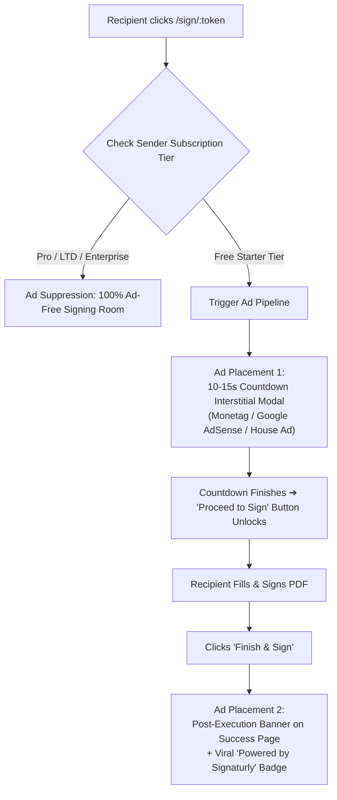

# ⚡ Signaturly Pro — Comprehensive Commercial, Ad Monetization & Scaling Master Plan (v2.0)

> **Executive Goal:** Build a hyper-competitive, high-margin, profitable e-signature platform that undercuts DocuSign/BoldSign with a generous ad-supported Free Tier (15 docs/mo), affordable subscription tiers ($5.99/mo, $69 LTD), comprehensive analytics, ad monetization revenue streams, error monitoring, and production guardrails.

---

## 📑 Master Table of Contents
1. [Executive Summary & Current Architecture Audit](#1-executive-summary--current-architecture-audit)
2. [Zero-Cost Bootstrap Production Infrastructure](#2-zero-cost-bootstrap-production-infrastructure)
3. [Deep-Dive: Free Tier Ad Monetization Architecture](#3-deep-dive-free-tier-ad-monetization-architecture)
4. [4-Tier Commercial Model & Paywall Mechanics](#4-4-tier-commercial-model--paywall-mechanics)
5. [Stripe & Razorpay Payment Architecture](#5-stripe--razorpay-payment-architecture)
6. [Analytics, Sentry Monitoring & Instant Alert Webhooks](#6-analytics-sentry-monitoring--instant-alert-webhooks)
7. [Security Guardrails, Rate Limiting & Abuse Prevention](#7-security-guardrails-rate-limiting--abuse-prevention)
8. [Multi-Tenancy Workspaces & Developer API (Enterprise)](#8-multi-tenancy-workspaces--developer-api-enterprise)
9. [Comprehensive File & Directory Blueprint](#9-comprehensive-file--directory-blueprint)
10. [Step-by-Step Implementation Sprints](#10-step-by-step-implementation-sprints)
11. [Verification & Automated Test Strategy](#11-verification--automated-test-strategy)

---

## 1. Executive Summary & Current Architecture Audit

Signaturly Pro has successfully achieved **100% v1.0 Core Engine Completion**. The core signing platform operates with:
- **Visual PDF Studio**: 72 DPI coordinate mapper supporting Signature, Initials, Date, Text, and Checkboxes.
- **Workflow Routing**: Sequential and parallel multi-signer routing with unique UUID token links.
- **Security & Statutory Proof**: 2FA Email OTP gates, SHA-256 baseline/sealed hashing, and automated non-repudiation audit certificates with QR codes.
- **Productivity Engines**: AI signature background eraser, 14 statutory templates, CSV bulk mail merge, and SSE real-time sync.

### The v2.0 Evolution
The goal of v2.0 is to transform this technology into a **dual-revenue SaaS**:
1. **Ad-Supported Revenue from Non-Paying Users**: Monetizing the high viral volume of free signers via non-intrusive interstitials and post-execution sponsor banners.
2. **Subscription & Lifetime Deal Revenue**: Converting power users, freelancers, and businesses to $5.99/mo, $49/yr, $69 LTD, and $14.99/user Enterprise plans.

---

## 2. Zero-Cost Bootstrap Production Infrastructure

> [!NOTE]
> The entire production stack is engineered to run at **$0.00 / month** on always-free cloud quotas until reaching massive scale.

| Service | Component in Code | Free Tier Quota | Monthly Cost |
| :--- | :--- | :--- | :--- |
| **Compute / Hosting** | **GCP Cloud Run** (Google Cloud) | 2,000,000 requests / month free | **$0.00** |
| **Document Vault** | **Google Cloud Storage (GCS)** (`STORAGE_PROVIDER=gcs`) | 5 GB standard storage free (~2,500 PDFs) | **$0.00** |
| **Transactional Email** | **Gmail SMTP Relay** (`smtp.gmail.com` + App Password) | 500 emails / day (15,000/mo) | **$0.00** |
| **Database** | **MongoDB Atlas** (M0 Cluster) | 512 MB storage (~10,000 contract records) | **$0.00** |
| **Frontend & Admin CDN** | **Vercel / Cloudflare Pages** | Unlimited preview & production bandwidth | **$0.00** |
| **Signer 2FA Security** | **Built-in Email OTP** (`otp.service.js`) | Included in Gmail SMTP relay | **$0.00** |
| **Edge CDN & WAF** | **Cloudflare** (Free Tier) | Unlimited DDoS mitigation, SSL & WAF | **$0.00** |
| **Total Baseline Cost** | — | — | **$0.00 / month** |

---

## 3. Deep-Dive: Free Tier Ad Monetization Architecture

The free tier allows users to send up to **15 documents/month for free**. To turn non-paying users into profit, Signaturly incorporates a structured, legally respectful ad monetization pipeline.



### 3.1 Ad Placement Touchpoints

| Placement | UI Location | Trigger Point | Ad Format | User Experience |
| :--- | :--- | :--- | :--- | :--- |
| **Placement 1: Pre-Signing Interstitial** | `/sign/:token` (Modal) | Immediately upon opening the signing room | 300x250 or 336x280 Display Ad with 10s countdown | User watches a brief countdown timer with a clean sponsor ad. Once the countdown ends, the **"Proceed to Document"** button activates. |
| **Placement 2: Completion Success Banner** | `/sign/:token` (Success Screen) | After final signature submission and PDF sealing | 728x90 Leaderboard or Native Card | Placed alongside the **"Download Signed PDF"** and **"Download Certificate"** buttons. High engagement rate. |
| **Placement 3: Dashboard Native Banner** | `/dashboard` (Free users only) | Bottom or Sidebar of sender's dashboard | Native Responsive Banner (Monetag / House Ads) | Displays SaaS deals, hosting promos, or upgrade discounts. Disappears immediately on upgrade. |
| **Placement 4: Viral Document Footer** | Signed PDF Last Page Margin | Burned into PDF vector stream for free tier | Text watermark: *"Executed securely with Signaturly Pro — Create Free Account"* | Drives organic viral signups from signers. |

### 3.2 Standardized Ad Network Strategy (Google Ads Ecosystem + In-House Fallbacks)

1. **Web Platform: Google AdSense / Google Ad Manager (Primary)**:
   - **Pre-Signing Vignette & Interstitial Modal**: Clean, brand-safe, reputable software and utility ads from Google's verified advertiser pool.
   - **Post-Execution Banner**: 728x90 Leaderboard or 300x250 Responsive Display on `/verify` and signing completion pages.
   - **Highest Brand Safety**: Guaranteed zero deceptive popunders, malware, or spam redirects.

2. **Mobile App Roadmap: Google AdMob (iOS & Android)**:
   - **Full Native SDK Support**: Seamless integration for future React Native or Flutter mobile apps.
   - **Interstitial & App Open Ads**: Displayed when switching documents or after finishing a mobile signature.
   - **Rewarded Ads Option**: *"Watch 1 short sponsor video to earn +1 Free Document Signature"*.
   - **100% App Store / Google Play Compliance**: Zero risk of store rejection.

3. **In-House Cross-Promotion House Ads (100% AdBlock-Immune Fallback)**:
   - When external scripts are blocked by AdBlockers (uBlock Origin, Brave, AdGuard) or pending Google approval:
     - *House Ad Slot 1*: **Signaturly Pro Lifetime Deal ($69)** upgrade banner.
     - *House Ad Slot 2*: Cross-promotional cards for your other owned software products and mobile apps.
     - *100% First-Party React Delivery*: Zero external tracking domains; impossible for AdBlockers to suppress.

4. **Ad Suppression Logic (`ad.middleware.js` & `ad.service.js`)**:
   - When a recipient requests `/api/v1/recipient/access/:token`, the backend checks `pdf.senderId.subscription.plan`.
   - If `plan !== 'free'`, the API returns `{ showAds: false }`. Frontend ad components will not render.

---

## 4. 4-Tier Commercial Model & Paywall Mechanics

```
+───────────────────────────────────────────────────────────────────────────────────────────+
|                                    COMMERCIAL TIERS                                       |
+──────────────────────────+──────────────────────────+─────────────────────────────────────+
| Tier Plan                | Pricing                  | Limits & Feature Entitlements       |
+──────────────────────────+──────────────────────────+─────────────────────────────────────+
| 1. Free Starter          | $0 / forever             | • 15 signature requests / month     |
|    (Ad-Supported)        |                          | • Standard signing studio & OTP     |
|                          |                          | • Ad-supported signing room         |
+──────────────────────────+──────────────────────────+─────────────────────────────────────+
| 2. Pro Creator           | $5.99 / month            | • Unlimited signature envelopes     |
|                          | ($49 / year — Save 32%)  | • 100% Ad-Free & Watermark-Free     |
|                          |                          | • Reusable custom templates         |
|                          |                          | • CSV Bulk Send (150 signers/batch) |
+──────────────────────────+──────────────────────────+─────────────────────────────────────+
| 3. Lifetime Pass (LTD)   | $69 One-Time Payment     | • Unlimited signatures forever      |
|                          |                          | • All Pro features for 1 user       |
|                          |                          | • Prime founder community badge     |
+──────────────────────────+──────────────────────────+─────────────────────────────────────+
| 4. Business & Enterprise | $14.99 / user / month    | • All Pro features                  |
|                          | ($129 / user / year)     | • Multi-Tenant Team Workspaces      |
|                          |                          | • Custom Brand White-Labeling       |
|                          |                          | • Developer REST API & Webhooks     |
+──────────────────────────+──────────────────────────+─────────────────────────────────────+
```

### 4.1 Quota Enforcement & Paywall Gating (`quota.middleware.js`)
- Every user document dispatch (`POST /api/v1/send/:pdfId`) checks the sender's quota.
- If `user.plan === 'free'` and `user.usedThisMonth >= 15`:
  - Request is blocked with `403 FORBIDDEN` (`code: "QUOTA_EXCEEDED"`).
  - Client catches error and triggers `UpgradeModal.jsx` with instant checkout buttons.
- **Monthly Auto-Reset**: `node-cron` job runs at `00:00 UTC` on the 1st of every month to reset `usedThisMonth = 0`.

---

## 5. Stripe & Razorpay Payment Architecture

```
                                  [ User Chooses Plan ]
                                            │
                    ┌───────────────────────┴───────────────────────┐
                    ▼                                               ▼
      [ Stripe Checkout (Global) ]                    [ Razorpay Checkout (India) ]
      • Credit/Debit Cards                            • UPI (Google Pay, PhonePe, Paytm)
      • Apple Pay / Google Pay                        • RuPay & NetBanking
      • Recurring Subscription or LTD                 • Razorpay Subscriptions / Orders
                    │                                               │
                    ▼                                               ▼
         [ Stripe Webhook Event ]                        [ Razorpay Webhook Event ]
         `checkout.session.completed`                    `payment.captured`
                    │                                               │
                    └───────────────────────┬───────────────────────┘
                                            ▼
                           [ Backend Subscription Service ]
                           • Updates User.plan to 'pro' / 'lifetime'
                           • Sets monthlyQuota = Infinity
                           • Dispatches Welcome Email & Telegram Alert
```

### 5.1 Webhook Lifecycle Events
- `checkout.session.completed` ➔ Sets user plan to `pro_monthly`, `pro_annual`, or `lifetime`.
- `customer.subscription.deleted` ➔ Reverts user to `free` (15/mo) upon billing cancellation.
- `invoice.payment_failed` ➔ Flags subscription as `past_due` and alerts user via email.
- `customer.billing_portal` ➔ Generates self-serve billing portal for card updates and invoices.

---

### 5.2 Plug-and-Play Zero-Credential Architecture (Dev Mode & Seamless Activation)

> [!IMPORTANT]
> The codebase is architected with **Zero-Key Simulation & Graceful Fallback Modes**. The entire billing, quota paywall, and ad monetization pipeline functions 100% out of the box in development without requiring any live API keys.

```
+───────────────────────────────────────────────────────────────────────────────────────────+
|                               CREDENTIAL PLUG-AND-PLAY MATRIX                             |
+──────────────────────────+──────────────────────────────+────────────────────────────────+
| Service                  | When Keys are ABSENT / EMPTY | When Keys are ADDED to .env    |
+──────────────────────────+──────────────────────────────+────────────────────────────────+
| **Google AdSense**       | Renders In-House Cross-Promo | Injects Google AdSense script  |
| `VITE_GOOGLE_ADSENSE_ID` | Banners for your sister apps | and serves live Google ads     |
+──────────────────────────+──────────────────────────────+────────────────────────────────+
| **Stripe Payments**      | Activates Dev Simulation     | Launches live Stripe Checkout  |
| `STRIPE_SECRET_KEY`      | Modal (1-click test upgrade) | session & billing portal       |
+──────────────────────────+──────────────────────────────+────────────────────────────────+
| **Razorpay Payments**    | Activates Dev UPI Simulation | Launches live Razorpay modal   |
| `RAZORPAY_KEY_ID`        | Modal for local testing      | for UPI & domestic cards       |
+──────────────────────────+──────────────────────────────+────────────────────────────────+
```

#### How to Activate Live Credentials in the Future (Zero Code Changes Required)
When you acquire your production credentials, simply paste them into `server/.env` and `client/.env`:

```env
# server/.env
STRIPE_SECRET_KEY=sk_live_51...
STRIPE_WEBHOOK_SECRET=whsec_...
RAZORPAY_KEY_ID=rzp_live_...
RAZORPAY_KEY_SECRET=your_razorpay_secret...

# client/.env
VITE_STRIPE_PUBLISHABLE_KEY=pk_live_51...
VITE_GOOGLE_ADSENSE_CLIENT_ID=ca-pub-XXXXXXXXXXXXXXXX
VITE_GOOGLE_ADSENSE_SLOT_ID=1234567890
```
The application will automatically detect the presence of real keys and transition from **Simulation Mode** to **Live Production Mode** seamlessly.

---

## 6. Analytics, Sentry Monitoring & Instant Alert Webhooks

### 6.1 Real-Time Alert Webhooks (`alert.service.js`)
An automated alert service dispatches instant push notifications to your private **Telegram Channel / Discord Webhook / Slack**:
- 💰 **Payment Alert**: *"🎉 New Lifetime Deal ($69.00) purchased by alex@company.com!"*
- ⚠️ **System Alert**: *"🚨 3 consecutive PDF-Lib flattening errors detected on /sign endpoint!"*
- 🛡️ **Security Alert**: *"🛡️ Rate limiter blocked IP 103.45.xx.xx (exceeded 60 req/min)."*

### 6.2 Error Monitoring (Sentry)
- **Backend**: Express error middleware automatically logs unhandled promise rejections, SMTP timeouts, and GCS connection drops.
- **Frontend**: React Error Boundary catches canvas rendering crashes on older mobile browsers.

### 6.3 Product Funnel Analytics (PostHog / GA4)
- **Conversion Funnel**: `Upload PDF` ➔ `Place Fields` ➔ `Send` ➔ `Signer Opened` ➔ `Signed`.
- **Paywall Funnel**: `Hit 15 Limit` ➔ `View Upgrade Modal` ➔ `Stripe Redirect` ➔ `Purchase`.

---

## 7. Security Guardrails, Rate Limiting & Abuse Prevention

```
Incoming Client Request
         │
         ▼
[ Cloudflare WAF & Edge CDN ] ──► Mitigates DDoS, enforces HTTPS, geoblocks malicious bots
         │
         ▼
[ Express Rate Limiter ] ──────► Max 60 req/min on public routes (/sign/:token, /auth/login)
         │
         ▼
[ File Upload Guardrail ] ─────► Max 25 MB file size, strict PDF magic number MIME validation
         │
         ▼
[ Anti-Spam Email Guardrail ] ──► Max 30 envelope dispatches per IP per hour for free tier
         │
         ▼
[ Signaturly Core Engine ]
```

---

## 8. Multi-Tenancy Workspaces & Developer API (Enterprise)

### 8.1 Team Workspaces (`Workspace.model.js`)
- Organization owners can invite team members with granular RBAC:
  - **Admin**: Can create templates, dispatch contracts, manage members, and view billing.
  - **Member**: Can upload contracts and send for signatures using organization templates.
  - **Viewer**: Read-only access to executed documents and audit certificates.

### 8.2 Developer REST API & Outgoing Webhooks
- **API Key Management (`ApiKey.model.js`)**: Users generate scoped API keys (`sk_live_...`) to programmatically dispatch contracts.
- **Outgoing Webhooks (`Webhook.model.js`)**: Dispatches real-time HMAC-signed webhooks to customer endpoints for:
  - `envelope.sent`
  - `recipient.signed`
  - `envelope.completed`
  - `envelope.voided`

---

## 9. Comprehensive File & Directory Blueprint

```
Signaturly/
├── server/
│   ├── src/
│   │   ├── config/
│   │   │   ├── db.js
│   │   │   ├── stripe.js                  [NEW] Stripe SDK initialization
│   │   │   ├── razorpay.js                [NEW] Razorpay SDK initialization
│   │   │   └── gcs.js                     [NEW] Google Cloud Storage bucket config
│   │   ├── models/
│   │   │   ├── User.model.js
│   │   │   ├── Pdf.model.js
│   │   │   ├── Recipient.model.js
│   │   │   ├── PdfAudit.model.js
│   │   │   ├── Template.model.js
│   │   │   ├── Subscription.model.js      [NEW] Tiers, quotas, Stripe customer links
│   │   │   ├── Workspace.model.js         [NEW] Multi-tenant organization accounts
│   │   │   ├── ApiKey.model.js            [NEW] Developer API keys
│   │   │   └── Webhook.model.js           [NEW] Outgoing webhook subscribers
│   │   ├── middlewares/
│   │   │   ├── auth.middleware.js
│   │   │   ├── quota.middleware.js        [NEW] 15 doc/mo limit & feature paywalls
│   │   │   ├── rateLimiter.middleware.js  [NEW] Express rate limiter security
│   │   │   └── ad.middleware.js           [NEW] Sender subscription ad check
│   │   ├── services/
│   │   │   ├── billing.service.js         [NEW] Checkout sessions & portal logic
│   │   │   ├── storage.service.js         [NEW] Dual Local/GCS cloud storage
│   │   │   ├── alert.service.js           [NEW] Telegram/Discord error & sale bot
│   │   │   └── webhookDelivery.service.js [NEW] Outgoing customer webhook queue
│   │   ├── controllers/
│   │   │   ├── billing.controller.js      [NEW] Checkout & billing portal handlers
│   │   │   ├── webhook.controller.js      [NEW] Stripe & Razorpay webhook processor
│   │   │   ├── workspace.controller.js    [NEW] Team organization endpoints
│   │   │   └── api.controller.js          [NEW] Developer public REST API
│   │   └── routes/
│   │       ├── billing.routes.js          [NEW] /api/v1/billing/*
│   │       ├── webhook.routes.js          [NEW] /api/v1/webhooks/*
│   │       ├── workspace.routes.js        [NEW] /api/v1/workspaces/*
│   │       └── api.routes.js              [NEW] /api/v1/v1-public/*
├── client/
│   ├── src/
│   │   ├── components/
│   │   │   ├── UpgradeModal.jsx           [NEW] Paywall modal with tier cards
│   │   │   ├── AdInterstitialModal.jsx    [NEW] 10-15s Countdown ad modal
│   │   │   ├── AdBanner.jsx               [NEW] Monetag/AdSense display banner
│   │   │   └── PricingCards.jsx           [NEW] Reusable monthly/annual pricing
│   │   ├── pages/
│   │   │   ├── Settings.jsx               [MODIFY] Add Billing & Invoices Tab
│   │   │   ├── Landing.jsx                [MODIFY] Add Interactive Pricing Section
│   │   │   ├── SigningPage.jsx            [MODIFY] Embed Ad Interstitial for free tier
│   │   │   ├── TeamWorkspaces.jsx         [NEW] Multi-user organization portal
│   │   │   └── ApiSettings.jsx            [NEW] Developer API key generator
│   │   └── api/
│   │       ├── billing.api.js             [NEW] Billing API hooks
│   │       └── workspace.api.js           [NEW] Workspace API hooks
```

---

## 10. Step-by-Step Implementation Sprints

```
+───────────────────────────────────────────────────────────────────────────────────────────+
|                                  IMPLEMENTATION SPRINTS                                   |
+──────────+──────────────────────────+──────────────────────────────────────+──────────────+
| Sprint   | Focus Area               | Key Deliverables                     | Status       |
+──────────+──────────────────────────+──────────────────────────────────────+──────────────+
| Sprint 1 | Quotas & Ad Engine       | • Subscription.model.js & middleware | ✅ COMPLETED |
|          |                          | • AdInterstitialModal & InHouseAdCard|              |
|          |                          | • Sender plan ad suppression logic   |              |
+──────────+──────────────────────────+──────────────────────────────────────+──────────────+
| Sprint 2 | Payment Gateways         | • Stripe & Razorpay billing service  | ✅ COMPLETED |
|          |                          | • Webhook handlers & 1-Click Dev Sim |              |
|          |                          | • Settings Billing Hub & Live Quota  |              |
|          |                          | • Refreshed 4-tier Landing Pricing   |              |
+──────────+──────────────────────────+──────────────────────────────────────+──────────────+
| Sprint 3 | Storage & Cloud Hardening| • Dual Local/GCS storage.service.js  | ✅ COMPLETED |
|          |                          | • Atomic reminder locking & shutdown |              |
+──────────+──────────────────────────+──────────────────────────────────────+──────────────+
| Sprint 4 | Alerting & Monitoring    | • Telegram/Discord alert.service.js  | ✅ COMPLETED |
|          |                          | • Subscription sale & error webhooks |              |
+──────────+──────────────────────────+──────────────────────────────────────+──────────────+
| Sprint 5 | Workspaces & API         | • Workspace.model.js multi-tenancy   | ✅ COMPLETED |
|          |                          | • ApiKey.model.js & Webhook.model.js |              |
+──────────+──────────────────────────+──────────────────────────────────────+──────────────+
| Sprint 6 | Automated Tests & CI/CD  | • Verification tests & CI deployment | 🚀 READY     |
+──────────+──────────────────────────+──────────────────────────────────────+──────────────+
```

---

## 11. Verification & Automated Test Strategy

### 11.1 Automated Test Matrix
1. **Quota Boundary Test**:
   - Create free user ➔ Send 15 envelopes (all succeed) ➔ Send 16th envelope ➔ Assert `403 QUOTA_EXCEEDED` and `UpgradeModal` triggers.
2. **Ad Suppression Verification**:
   - Send envelope from Free user ➔ Open `/sign/:token` ➔ Assert `AdInterstitialModal` displays with countdown.
   - Send envelope from Pro user ➔ Open `/sign/:token` ➔ Assert `AdInterstitialModal` is completely absent.
3. **Stripe Webhook Simulation**:
   - Post simulated `checkout.session.completed` for LTD ($69) to `/api/v1/webhooks/stripe` ➔ Assert `User.plan` changes to `lifetime` and `monthlyQuota` becomes `Infinity`.
4. **Rate Limiting Test**:
   - Send 70 rapid requests to `/api/v1/auth/login` within 60 seconds ➔ Assert `429 Too Many Requests` is returned on request #61+.

---
*Signaturly Pro v2.0 Master Plan — Engineered for Zero-Cost Operations, High Conversion, and Enterprise Reliability.*
